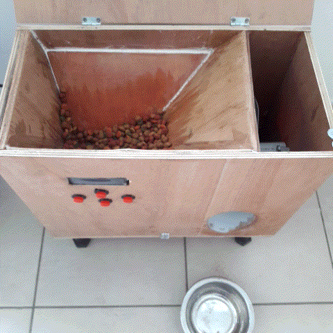
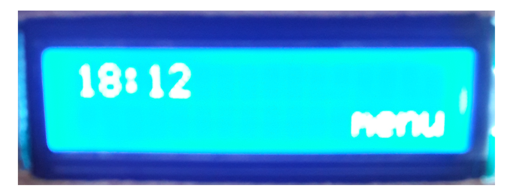
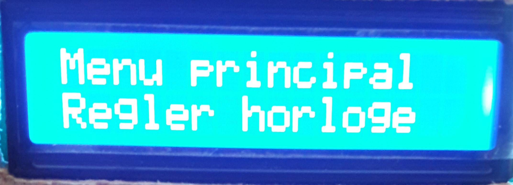
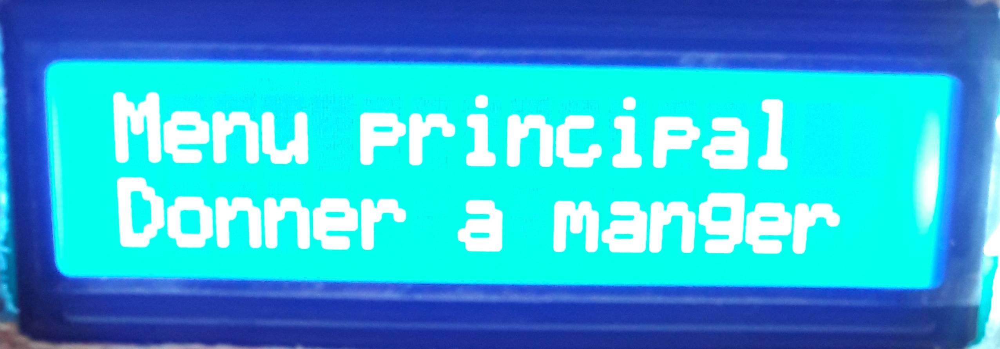
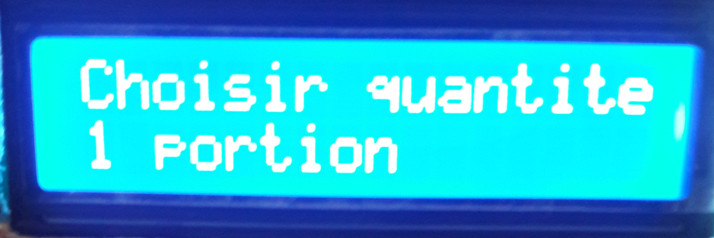
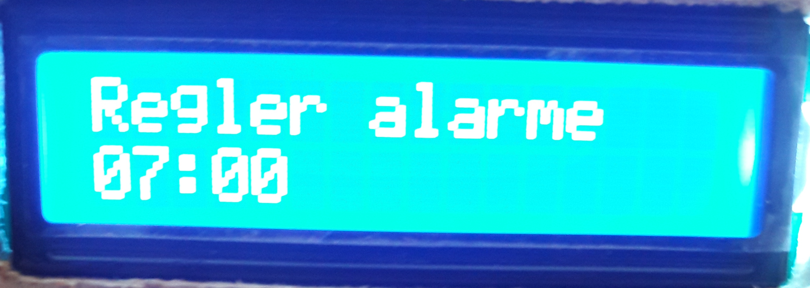
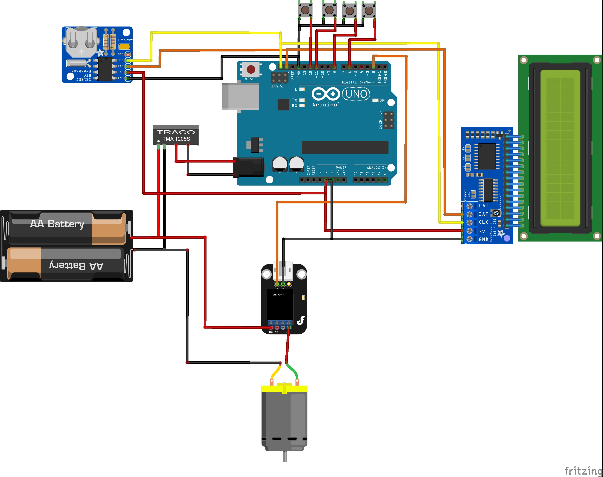
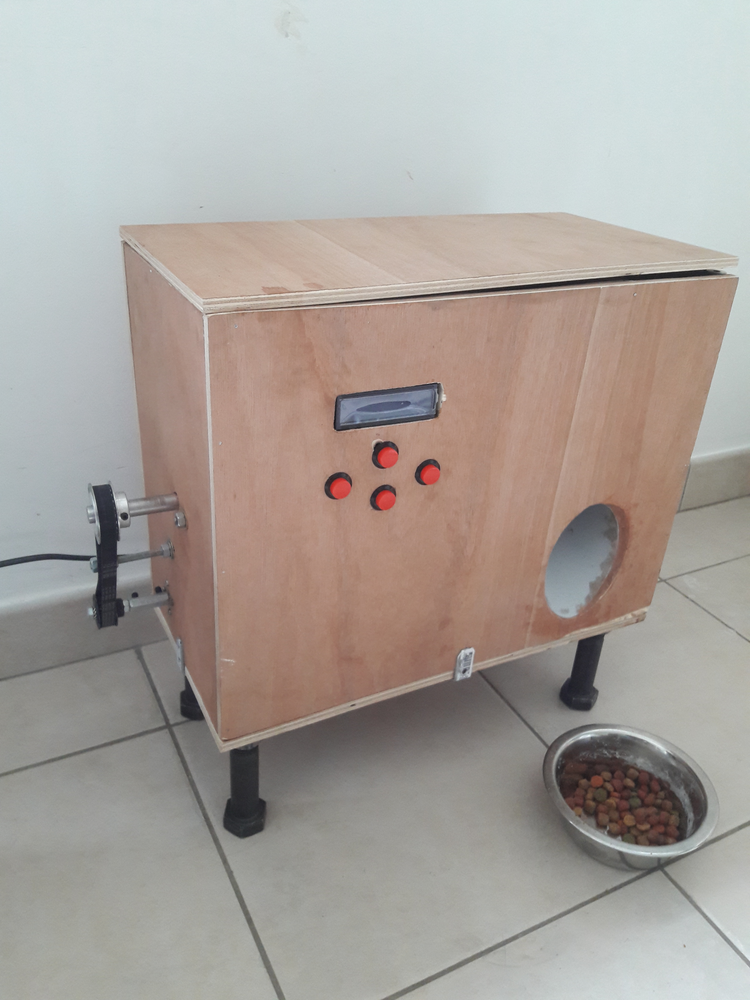
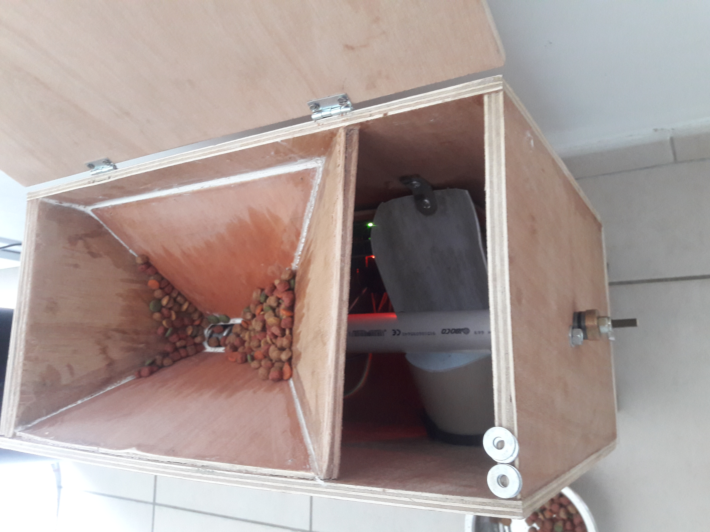

# Catfeeder

Example for building your own automatic catfeeder built with Arduino uno

## About

This is a example, with software provided, on how automate feeding your pets.

This repo contains schemas, and source code.

## How does it work ?

The feeder dispenser is very simple.
It consists of a self-made wood frame and an archimede screw powered by an arduino uno.
The arduino drives the motor which drives the screw. The food is then pushed into a spilway.

It offers a menu, througn a LCD screen, in which find :
- Time programming : you need to set the time at first power-up.
- Alarms programming : up to 5 alarms can be set in a day to program a food distribution.
- Food distribution : you can choose the amount of food to be dispensed and then operate the engine.

A sleep mode id used to turn off the LCD scren to prevent overcurrent. It appears after 30 secondes of inactivity.
In this mode, the 'OK' button switches the display back on. The others help to distribute food quickly.

  

## Menu screen

  main screen   
  

  main menu   
  
  
  

  Feed the cat   
  

  Set an alarm   
  

## Electronics
#### Components list
- Arduino Uno
- 9v DC/DC
- Relay
- Power supply

#### Diagram

  

## Frame

  

  

## Install software
1/ Install Arduino environnement : https://www.arduino.cc/en/Main/Software

2/ Download the source code or clone it : "git clone https://github.com/vdbvincent/catfeeder.git"

3/ Put all the *.h and *.ino files into a named "catfeeder" folder

4/ Upload the soft into your Arduino board

## Contribute
Please, feel free to send me a pull request !

## Next to do
* RF communication
* Android interface for settings
* Feelling sensor
